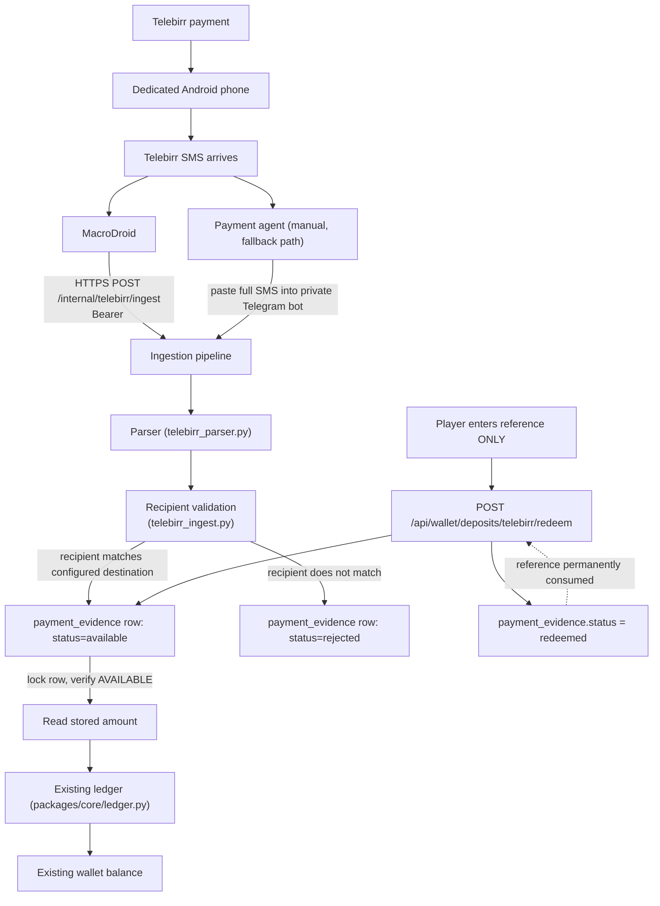

# Telebirr SMS Payment System — Operations Guide

Status as of this document: **code complete, verified with a real live
end-to-end run against real running services. Not yet deployed to
production. `telebirr_sms` ships disabled by default.**

This guide documents the system **as it is actually implemented** in this
repository today, verified against the live code and live database schema
while writing it (section 25 below lists exactly what was checked). Where
something described elsewhere (an earlier directive, an assumption) does
not match the code, this document follows the code and says so.

---

## 0. 5-Minute Operator Quick Start

For an **already configured, already enabled** production system:

1. Confirm the dedicated Android phone is powered on and has signal.
2. Confirm MacroDroid's macro is enabled (toggle at top of the macro list).
3. Send a real Telebirr payment; confirm the SMS arrives on the phone.
4. Confirm the payment agent has access to the private Telegram bot.
5. Agent copies the **entire** SMS text and pastes it into the bot as a
   plain message.
6. Bot replies confirming ingestion (`Recorded. Reference ... is ready to
   be redeemed.` or a rejection with a reason — see §5).
7. Player opens the wallet, taps **Deposit → Telebirr**, and types **only**
   the transaction reference (e.g. `DI26D9N4AW`) — no amount, no name, no
   phone number.
8. Confirm the wallet balance increased by exactly the amount Telebirr's
   own SMS stated.
9. The same reference will never work again — confirm a second submission
   is rejected as already redeemed.

If any step fails, go to §15 (Troubleshooting).

---

## 1. Architecture Overview



Two real, confirmed SMS templates feed the same pipeline (see §13). Two
independent ingestion **sources** feed the same pipeline: MacroDroid (HTTP)
and a Telegram payment agent (bot text message). Neither source has any
parsing or acceptance logic of its own — both are thin adapters that call
the exact same function, `ingest_sms_evidence()`.

| Component | Responsibility | File |
|---|---|---|
| Android phone + SIM | Receives the real Telebirr SMS | (hardware, §3) |
| MacroDroid | Forwards the complete SMS text over HTTPS | (device config, §3) |
| Ingestion device registry | Per-device credential, revocation, health tracking (2026-09-11) | `services/payments/device_registry.py`, `ingestion_devices` table |
| Telegram payment agent | Manual fallback: pastes the complete SMS into the bot | `services/bot/handlers.py` |
| Ingestion pipeline | Parses, validates recipient, stores canonical record | `services/payments/telebirr_ingest.py` |
| Parser | Extracts reference + exact amount (+ fee/VAT/recipient) | `services/payments/telebirr_parser.py` |
| Payment evidence | The canonical, reference-keyed payment record | `payment_evidence` table |
| Redemption service | Player reference → stored amount → wallet credit | `services/payments/telebirr_redemption.py` |
| Existing ledger | The one, only source of truth for balances | `packages/core/ledger.py` |
| Reconciliation | Detects no-source / double-credit anomalies | `services/payments/telebirr_reconcile.py` |
| Admin console | Review evidence, resolve disputes, manage agents/recipients | `services/admin/*`, `web/admin/js/screens/telebirr_evidence.js`, `payment_agents.js`, `payment_destinations.js` |

---

## 2. The Business Rule (Non-Negotiable)

```text
INGESTION:  reference + exact amount, extracted from the real SMS
PLAYER:     reference ONLY
SERVER:     look up reference → read stored amount → credit existing
            wallet → mark reference redeemed
```

The player-facing redemption request accepts exactly one field:

```json
{ "reference": "DI26D9N4AW" }
```

`services/gateway/app.py`'s `TelebirrRedeemRequest` Pydantic model has no
`amount`, `recipient`, `phone`, or `account` field at all — there is no
code path that could honor one even if a client sent it. Verified live
(§21): sending `{"reference": "DI26D9N4AW", "amount": "5000"}` still
credits exactly the stored amount.

```text
ONE REFERENCE = ONE PAYMENT = ONE STORED AMOUNT = MAXIMUM ONE WALLET CREDIT
```

Enforced by: `payment_evidence.external_reference` is `UNIQUE` at the
database level, `redeem_evidence()` locks the row (`FOR UPDATE`) inside one
transaction before checking status, and a second redeemer (same or
different user) is rejected — see §12 and §21.

---

## 3. MacroDroid — Android Setup

This section is the condensed version. The standalone technician
worksheet is `docs/TELEBIRR_MACRODROID_QUICK_SETUP.md` — print or share
that file with whoever sets up the physical phone; this section explains
the *why* behind each step.

### 3.1 Phone requirements

| Requirement | Detail |
|---|---|
| Android version | MacroDroid supports Android 5.0+; Android 10+ recommended for reliable background SMS access under modern battery restrictions. |
| SIM | A real, active SIM registered to the Telebirr account that will receive/send the payments this system ingests. |
| SMS | Must be able to **receive** SMS (standard for any active voice/SMS SIM). |
| Network | Mobile data **or** Wi-Fi, either works — MacroDroid just needs outbound HTTPS to reach the ingest endpoint. A stable connection matters more than which type. |
| Power | Keep permanently plugged in / charging. This is a fixed appliance, not a carried phone. |
| Screen lock | Disable screen lock (or set to "swipe"/none) — a locked screen does not stop background SMS receipt on most devices, but removes one more variable and makes physical checks easier. |
| Notifications | Allow notification access if you want MacroDroid's own status notifications; not required for the macro itself to run. |
| Background execution | **Required.** See §3.2. |
| Battery optimization | **Must be disabled for MacroDroid.** This is the single most common real-world cause of "SMS arrives, server never sees it" — Android kills backgrounded apps to save battery unless explicitly excluded. |
| Auto-start | On Chinese-market Android skins (Xiaomi/MIUI, Huawei/EMUI, Oppo/ColorOS, Vivo/FuntouchOS) there is an *additional*, separate "autostart" permission beyond standard Android battery optimization — the exact menu location varies by manufacturer and OS version; MacroDroid's own documentation and forum maintain an up-to-date list. Say so explicitly rather than guessing a menu path for every OEM. |

### 3.2 Preparation checklist

```text
Register this phone as a device in the admin console, copy its
  one-time token (§3.2a) -- do this BEFORE touching the phone
  ↓
Install SIM
  ↓
Connect to internet (mobile data and/or Wi-Fi)
  ↓
Install MacroDroid from the Play Store
  ↓
Grant SMS permission (Read SMS, Receive SMS)
  ↓
Disable battery optimization for MacroDroid
  (Android Settings → Apps → MacroDroid → Battery → Unrestricted)
  ↓
Enable background/auto-start permission (manufacturer-specific, see 3.1)
  ↓
Configure the macro (§3.3), using the token from step 1
  ↓
Send yourself a real or realistic-format test SMS
  ↓
Confirm the payments service logged/stored the ingestion (§3.6, §15)
  ↓
Confirm the device's row in Ingestion Devices shows a real last_seen_at
```

### 3.2a Registering the device (do this first, per phone)

As of 2026-09-11, every new phone should get its **own** credential
rather than reusing the legacy shared token (§4 explains why). In the
admin console:

1. Navigate to **Ingestion Devices** (nav bar).
2. Fill in **Device id** — a fixed, unique, human-typable string for
   this exact physical phone, e.g. `samsung-a15-shop-till`. This is a
   *label*, not a secret (§4.1) — it can appear in logs freely.
3. Fill in **Device name** — a human label for the console list, e.g.
   `Shop till Android #1`.
4. Click **Register device**. A panel shows the real bearer token
   **exactly once** — copy it now into a temporary secure note. It
   cannot be viewed again afterward (only rotated, §4.3).
5. Use this exact token as the `Authorization: Bearer <token>` header
   value in §3.3/3.4's macro, and this exact device id as the
   `device_id` body field.

Requires the `payments:configure` permission (superadmin only, same as
every other payments-credential-provisioning action in this system —
§6.1).

### 3.3 The macro

#### Trigger

**SMS Received**, filtered on message content — not a blanket "forward
every SMS" trigger. The parser (§13) only recognizes messages containing
either `"You have received"` or `"You have transferred"` (case-
insensitive) — anything else is rejected server-side anyway, but filtering
in MacroDroid keeps the ingest endpoint from being hit with irrelevant
traffic (OTP codes, promotions, unrelated SMS) and keeps MacroDroid's own
logs meaningful.

Recommended trigger filter (MacroDroid's SMS Received trigger supports a
"Message Content" filter):

```text
Contains: "Your transaction number is"
```

This phrase appears in both confirmed real Telebirr templates and in no
other message type observed so far. Do **not** filter on sender number —
Telebirr's own sending short-code can change, and the trigger filtering
here is a convenience, not a security control; final acceptance is always
the server's parser + recipient check (§13, §14), never MacroDroid.

#### Actions

```text
SMS Received (trigger fires)
  ↓
Local Variable: capture the SMS body (MacroDroid's built-in
  [sms_message] trigger variable already holds the complete text —
  no extraction/parsing inside MacroDroid, that is the server's job)
  ↓
HTTP Request action:
  Method: POST
  URL:    https://<your-payments-domain>/internal/telebirr/ingest
  Headers:
    Authorization: Bearer <this device's token from §3.2a, or the
                   legacy MACRODROID_INGEST_TOKEN -- §4>
    Content-Type: application/json
  Body (JSON):
    {
      "raw_sms": "[sms_message]",
      "device_id": "<this device's registered device_id from §3.2a,
                     or any fixed string if using the legacy token>"
    }
  ↓
Handle response:
  HTTP 200 → parse JSON, log "status" field
  HTTP 401 "invalid bearer token" → token wrong/missing (§4, §15)
  HTTP 401 "device revoked" → this device's credential was revoked (§4.4, §15)
  HTTP 422 → raw_sms was empty (should not happen from a real trigger)
  HTTP 503 → server-side: nothing configured at all (§4)
  ↓
Optional: MacroDroid notification showing success/failure for the
  technician monitoring the phone
```

`device_id` is a string identifying this specific phone (e.g.
`"phone-1"`, `"shop-till-android"`), stored as `payment_evidence.
source_ref`. When a per-device token authenticates the request, the
*token* is what actually establishes identity — the body's `device_id`
is cosmetic in that case (a mismatch or typo here does not break
anything, §4.1); it is only load-bearing on the legacy shared-token
path, where it always has been.

**Do not** have MacroDroid try to extract the reference or amount itself
and send only those — the endpoint requires the **complete** SMS text
(`raw_sms`) because the server-side parser, not MacroDroid, is the only
component trusted to extract financial data (CTO directive requirement:
"MacroDroid must be a thin adapter... must NOT decide payment amount,
payment validity").

### 3.4 Where to click inside MacroDroid

```text
MacroDroid
  → Add Macro (+ button)
  → Trigger
    → Messaging
      → SMS Received
      → set the "Message Content" filter (Contains: "Your transaction number is")
      → Save
  → Action
    → Connectivity
      → HTTP Request
      → Method: POST
      → URL: https://<payments-domain>/internal/telebirr/ingest
      → Headers: add "Authorization" = "Bearer <token from §3.2a or §4>", "Content-Type" = "application/json"
      → Body: switch to "Raw Text" / JSON mode, paste the JSON body above
        using MacroDroid's [sms_message] variable for raw_sms
      → Response handling: enable "Store result in variable" if you want
        to branch on status/log it
      → Save
  → name the macro (e.g. "Telebirr SMS -> Ingest")
  → Save Macro
  → toggle it ON at the top of the macro list
```

Exact menu wording can shift slightly between MacroDroid app versions —
the navigation path above (Trigger → Messaging → SMS Received; Action →
Connectivity → HTTP Request) has been stable across MacroDroid's recent
releases at the time of writing.

### 3.5 MacroDroid variables

| Variable | Purpose | Example | Secret? |
|---|---|---|---|
| `INGEST_URL` | The server's ingestion endpoint | `https://pay.arada.fun/internal/telebirr/ingest` | No |
| per-device token (§3.2a, §4.1) | Bearer token authenticating this one phone | `<generated secret, shown once>` | **YES — never store in plain view, never share, never commit** |
| `MACRODROID_INGEST_TOKEN` (legacy, §4.2) | Bearer token shared by every phone still using it | `<generated secret>` | **YES — same care, but compromise/rotation affects every phone using it at once** |
| `device_id` | Identifies which phone sent this SMS | `"shop-till-android"` | No — a label, never treated as a credential |
| `[sms_message]` | MacroDroid's own built-in trigger variable holding the complete SMS body | (n/a — built-in) | The SMS itself is financial evidence; treat the device/app holding it with the same care as the token |

Only these are required by the implemented endpoint. Do not configure a
sender-phone or amount variable — the endpoint does not accept them.

---

## 4. Device Credentials — the Full Runbook

Two independent credential mechanisms authenticate `POST /internal/
telebirr/ingest`, checked in this order on every request
(`services/payments/app.py::_authenticate_ingest_request`):

1. **Per-device token** (§4.1) — one credential per physical phone,
   managed entirely through the admin console. **This is the credential
   every new phone should use.**
2. **Legacy shared token** (§4.2) — one credential for every phone still
   using it, managed through the server's `.env`. Kept working
   unmodified for whatever was configured before per-device tokens
   existed (2026-09-11); not the recommended path for a new phone.

Both reach the exact same `ingest_sms_evidence()` pipeline — nothing
about parsing, recipient matching, or evidence storage differs by which
credential authenticated the request.

### 4.1 Per-device tokens (recommended)

| Question | Answer |
|---|---|
| Where is it configured? | The `ingestion_devices` table (`migrations/versions/e3a7c9f01b2d`), managed exclusively through the admin console — no env var, no server restart needed for any of the actions below. |
| How is it generated? | `secrets.token_urlsafe(32)` (`packages/core/device_auth.py`) at the moment an admin clicks **Register device** or **Rotate token** — never typed in by a human. |
| Where is it stored server-side? | Only its SHA-256 hash (`ingestion_devices.token_hash`). The plaintext is never persisted anywhere and cannot be recovered — only rotated. |
| How is it shown to an admin? | Exactly once, in the response panel immediately after **Register device** or **Rotate token** — copy it into the phone's MacroDroid header immediately. Leaving that page loses it permanently (rotation is the only recovery). |
| How to register a new device | Admin console → **Ingestion Devices** → fill in device id + device name → **Register device** (§3.2a). Requires `payments:configure`. |
| How to rotate (suspected leak, or routine hygiene) | **Ingestion Devices** → find the device's row → **Rotate token**. The old token stops authenticating the instant this commits — there is never a window where both the old and new token work. Update the phone's MacroDroid header with the new value right away. Requires `payments:configure`. |
| How to revoke (phone lost/decommissioned) | **Ingestion Devices** → find the device's row → **Revoke**. Immediate — the next request from that phone gets `401 "device revoked"`. Reversible (**Reactivate**) if revoked by mistake. Requires `payments:configure`. |
| How to see a device's health | **Ingestion Devices** list — `last_seen_at`, `last_success_at`, `last_error_at`/`reason`, success/duplicate/failure/auth-failure counts, and a computed `health`: `healthy` / `degraded` (§17.1) / `awaiting_first_ingestion` (registered, never yet succeeded) / `revoked`. Requires `payments:view` (support/finance/ops/superadmin can all see this — only mutating a device needs `payments:configure`). |
| How must it NOT be exposed? | Never logged (grepped every touched file — zero log call references it), never returned by the list/GET endpoint (which explicitly enumerates non-secret columns only), never re-displayed after the one-time creation/rotation panel. |
| Phone lost | Revoke that device specifically (above) — every *other* phone keeps working untouched, unlike the legacy shared token. |
| Token leaked | Rotate that device specifically — same isolation property. |
| Multiple phones | Each gets its own row, its own token, its own health history — a Ingestion Devices list with 5 phones tells you which specific one has gone quiet, not just "ingestion overall looks fine on average." |

### 4.2 The legacy shared `MACRODROID_INGEST_TOKEN`

| Question | Answer |
|---|---|
| Where is it configured? | `packages/core/config.py`'s `Settings.macrodroid_ingest_token`, populated from the `MACRODROID_INGEST_TOKEN` environment variable. Empty by default. |
| How is it generated? | `python -c "import secrets; print(secrets.token_hex(32))"` (documented directly in `config.py`'s own comment and `.env.example`). |
| Where is it stored? | The server's `.env` file (never committed) and, on each phone using it, inside that phone's MacroDroid HTTP Request header. |
| How to rotate it | Generate a new value, update the server's `.env`, restart the payments service, then update **every** device still configured with the old value — there is exactly one token for all such devices, so rotating it requires touching every one of their macros in the same maintenance window. |
| Phone lost (using this token) | Rotate immediately — this breaks every other phone still using the shared token too; migrating them to individual per-device tokens (§4.1) first avoids this blast radius going forward. |
| How to disable entirely | Set `MACRODROID_INGEST_TOKEN` to empty and restart the payments service. Per-device tokens (§4.1) are unaffected — they are a completely independent mechanism, so disabling this legacy path never disables any registered device. |

### 4.3 Choosing between them

New phone → always register a per-device token (§4.1). The legacy
shared token exists only for continuity with whatever was configured
before 2026-09-11; there is no reason to add a *new* phone to that
shared pool today.

### 4.4 What "device revoked" means to the phone

MacroDroid sees a normal HTTP response, `401` with body `{"detail":
"device revoked"}` — not a network error, not a timeout. The SMS itself
is untouched in the phone's inbox (§15's retry guidance still applies);
only forwarding stops until an admin either reactivates the device or
issues a new one.

Never put a real token value (either kind) in this file or any other
committed document. Always write `<token>` / `<MACRODROID_INGEST_TOKEN>`.

---

## 5. Endpoint Documentation

### 5.1 `POST /internal/telebirr/ingest`

Real code: `services/payments/app.py`.

| | |
|---|---|
| Auth | `Authorization: Bearer <token>` — either a per-device token (looked up by its SHA-256 hash against `ingestion_devices`) or the legacy shared `MACRODROID_INGEST_TOKEN`, checked strongest-first (§4). Both compared without a timing side-channel. |
| Required headers | `Authorization`, `Content-Type: application/json`. |
| Request body | `{"raw_sms": "<complete SMS text>", "device_id": "<string>"}` — `device_id` is cosmetic once a per-device token authenticates (§3.3); load-bearing only on the legacy path. |
| Success response (200) | `{"status": "<see below>", "evidence_id": <int or null>, "external_reference": "<string or null>", "reason": "<string or null>", "device_name": "<string or null>"}` — `device_name` is populated only when a per-device token authenticated the request. |
| 401 `"invalid bearer token"` | Missing or wrong bearer token (neither mechanism matched). |
| 401 `"device revoked"` | The presented token belongs to a real, registered device whose credential has been revoked (§4.4) — never silently falls through to the legacy token even if one is configured. |
| 422 | `raw_sms` was empty/whitespace-only. |
| 503 | Nothing is configured server-side at all — no legacy token set AND zero devices registered. |
| Rate limiting | None on this route specifically today — see §24 for this as a known limitation. |
| Logging | Every outcome is logged via structlog (`telebirr_ingest_new_evidence`, `telebirr_ingest_unparseable`, `telebirr_ingest_conflicting_duplicate`) with reference/evidence id/reason, never the bearer token or the raw SMS text. |
| Audit | The `payment_evidence` row itself (source, source_ref, timestamps, status, reject_reason) is the audit trail for ingestion — no separate `admin_audit_log` entry (that table is reserved for admin-triggered actions, see §14). |

`status` is one of:

| Status | Meaning |
|---|---|
| `ingested_available` | Parsed cleanly, recipient matched a configured destination — a new, redeemable `payment_evidence` row was created. |
| `ingested_rejected` | Parsed cleanly, but the recipient did **not** match any configured destination — a new, **not** redeemable row was created (`reject_reason: "recipient_not_recognized"`). |
| `duplicate` | The exact same SMS (same reference, same byte-identical text) was already ingested — idempotent no-op, no new row. |
| `conflicting_duplicate` | Same reference, but **different** message text than what is already stored — the existing row is flagged `disputed`, never silently overwritten. |
| `unparseable` | No reference could be extracted at all — nothing is persisted; only a log line exists. |

### 5.2 `POST /api/wallet/deposits/telebirr/redeem`

Real code: `services/gateway/app.py`.

| | |
|---|---|
| Auth | `Authorization: tma <Telegram initData>` — the same boundary every other gateway route uses (`packages/core/telegram_auth.py`). |
| Request body | `{"reference": "<string>"}` — **no other field is read.** |
| Success response (200) | `{"success": true, "reference": "<normalized reference>", "amount": "<decimal string>", "currency": "ETB", "our_ref": "<internal DEP-YYYY-NNNNNN reference>"}` |
| Error response (422) | `{"detail": "<one of the codes below>"}` |
| 503 | `telebirr_sms` is not currently enabled for deposits (§20). |
| 401 | Missing/invalid Telegram auth. |

Error `detail` codes (from `RedemptionCode` in
`services/payments/telebirr_redemption.py`):

| Code | Meaning |
|---|---|
| `invalid_reference` | Empty/whitespace reference submitted. |
| `payment_not_found` | No evidence row for that reference. |
| `payment_already_redeemed` | Redeemed already, by a **different** user (a same-user retry instead returns 200 with the original success — §16). |
| `payment_blocked` / `payment_disputed` / `payment_expired` | Evidence is in a non-redeemable admin/policy state (§12). |
| `rate_limited` | More than 10 redemption attempts/hour from this user (`rate_limit.TELEBIRR_REDEEM`). |
| `daily_cap_exceeded` | Crediting this amount would exceed the player's daily deposit cap — the same check every other deposit rail enforces. |
| `self_excluded` / `cooling_off` / `account_banned` / `unknown_user` | The same responsible-gaming/account-status gate every other deposit rail enforces (`deposits._check_deposit_eligibility`, reused verbatim). |

What the server does, every time:

```text
normalize(reference)
  → SELECT ... FROM payment_evidence WHERE external_reference = $1 FOR UPDATE
  → verify status == 'available' (or return the prior success if this
    same user already redeemed it)
  → run the shared eligibility check (self-exclusion/ban/cooloff/cap)
  → INSERT payments row, amount = evidence.amount (never client input)
  → ledger.post() — the existing ledger, idempotency_key = our_ref
  → UPDATE payment_evidence SET status='redeemed', redeemed_by_user_id=...
  → COMMIT
  → (after commit only) notify player, publish balance update
```

What the server never trusts from this request: a client-supplied amount
(the field does not exist), recipient name, phone number, or account
number (none of these fields exist in the request model either).

---

## 6. Admin Role

### 6.1 Access

- Login: `POST /auth/login` (`services/admin/app.py`) — username, password,
  TOTP code → bearer session token. The admin console frontend is served
  at `/console` (`web/admin/`), IP-allowlisted in production
  (`ADMIN_IP_ALLOWLIST`).
- Roles (`services/admin/rbac.py`): `support`, `finance`, `ops`,
  `superadmin`. Verified live against the RBAC table, not assumed:

| Permission | support | finance | ops | superadmin |
|---|---|---|---|---|
| `payments:view` | yes | yes | yes | yes |
| `payments:view_raw_evidence` | **no** | yes | **no** | yes |
| `payments:approve` | **no** | yes | **no** | yes |
| `payments:configure` | **no** | **no** | **no** | yes |

### 6.2 What an admin can do (and which screen)

| Capability | Screen (`web/admin/js/screens/`) | Permission required |
|---|---|---|
| List/search Telebirr payment evidence, filter by status | `telebirr_evidence.js` (nav: "Telebirr Evidence") | `payments:view` |
| View the raw SMS text of one evidence row | Same screen, "View SMS" button | `payments:view_raw_evidence` (support/ops get a 403, shown as a toast, not a crash) |
| Resolve evidence (`blocked`/`disputed`/`rejected` → `available`, `available` → `blocked`/`disputed`) | Same screen, per-row resolve buttons, requires a typed reason | `payments:approve` |
| List/create/deactivate Telegram payment agents | `payment_agents.js` (nav: "Payment Agents") | list: `payments:view`; create/deactivate: `payments:configure` |
| Register/revoke/reactivate/rotate a MacroDroid ingestion device, view its health | `ingestion_devices.js` (nav: "Ingestion Devices") | list/health: `payments:view`; register/revoke/reactivate/rotate: `payments:configure` |
| Configure the recognized recipient (name, account, active window) | `payment_destinations.js` (nav: "Payment Destinations") — same screen the existing manual-deposit destinations already use, extended with **Valid from/Valid until** fields | list: `payments:view`; create/edit: `payments:configure` |
| Enable/disable the `telebirr_sms` rail | `provider_availability.js` (existing screen, not Telebirr-specific) | `payments:configure` |
| View admin audit log (who resolved what, who changed the recipient, who toggled availability) | `audit.js` (existing screen) | `audit:view` (superadmin only) |

### 6.3 What an admin cannot do

- Cannot see a player's reference-only redemption request "amount" field
  before it happens — there is none to see; the amount is whatever the
  evidence row already stores.
- Cannot manually credit a wallet through this feature's own UI — only
  through the *existing*, separate manual-deposit admin-approval flow
  (`manual_deposits.js`), which is a different rail entirely.
- Cannot move a `redeemed` evidence row back to `available` through the
  resolve action — that transition does not exist (§12). A wrongly-
  credited payment is a ledger correction handled through the existing
  controlled remediation process, never a status flip.
- **NOT IMPLEMENTED**: a dedicated Telebirr-specific reconciliation
  *dashboard* screen. The reconciliation numbers exist (`telebirr_evidence_
  by_status`, `telebirr_evidence_reconciliation_mismatch_count` — both
  real Prometheus metrics, §17) and are queryable directly
  (`evidence_status_breakdown()`/`find_evidence_source_mismatches()` in
  `services/payments/telebirr_reconcile.py`), but there is no admin-
  console page rendering them as a chart/table yet. The system is fully
  operable without it — an operator with database or Grafana access can
  already see everything; this is a UI convenience gap, not a functional
  one.

### 6.4 Investigating a failed or duplicate payment

1. Open **Telebirr Evidence**, filter by status (`rejected` for
   recipient-mismatch failures, `disputed` for conflicting resubmissions).
2. Click **View SMS** (finance/superadmin only) to read the exact original
   text — every view is itself audited (`admin_audit_log`, action
   `payment_evidence.view_raw_sms`, written whether or not the id even
   exists).
3. For a `rejected` row where the recipient config was simply missing/
   wrong at ingestion time: fix the recipient config (Payment
   Destinations), then use the evidence row's **→ available** resolve
   button with a reason documenting why (e.g. "recipient added after the
   fact, manually verified legitimate").
4. For a `disputed` row (conflicting resubmission): compare the stored
   `raw_sms` against whatever the agent/player is now claiming; resolve
   forward only if you have independently confirmed which version is
   real.

---

## 7. Payment Agent Role

```text
1. A player makes a Telebirr payment to the configured Zemen Game
   Telebirr account, following whatever business process is in place
   (e.g. paying in person, or via Telebirr directly).
2. Telebirr sends its own confirmation SMS to the dedicated phone/agent.
3. The agent opens the private Telegram payment bot.
4. The agent pastes the COMPLETE Telebirr SMS text as a plain message.
5. The server ingests and parses it (the exact same pipeline MacroDroid
   uses).
6. The payment becomes AVAILABLE only if the recipient in the SMS matches
   a configured, active destination.
7. The player (separately, in the Mini App) enters only the transaction
   reference to redeem it.
```

| Question | Answer |
|---|---|
| How does an agent get access? | An admin adds their real Telegram user id to the `payment_agents` table via the admin console (**Payment Agents** screen, `payments:configure`, superadmin only). |
| How is the agent authorized? | `services/bot/handlers.py`'s `on_agent_sms` handler is gated by a filter (`_is_active_payment_agent`) checking `payment_agents.telegram_user_id = <sender> AND is_active`. No dedicated bot command exists — **any plain-text message** from an authorized sender is treated as a forwarded SMS. |
| How is the Telegram user id configured? | Real integer Telegram user id (visible to the user themselves via any "what's my Telegram id" bot, or via `@userinfobot`), entered by an admin in the Payment Agents screen. |
| What is the agent allowed to send? | The complete, unedited Telebirr SMS text. Nothing else is meaningfully processed — any other text from an authorized agent is still routed through `ingest_sms_evidence()` and will simply come back `unparseable`. |
| What is the agent NOT allowed to send? | There is no restriction encoded beyond "you must be on the allow-list" — the agent should be trained never to send anything *other* than the real SMS (e.g. never paraphrase it, never type just the reference and amount by hand) since the parser needs the real text. |
| Unauthorized Telegram user sends SMS-shaped text | The message is **never** ingested — the filter fails, and the text falls through to the bot's normal (unrelated) menu-text handler, which for an unregistered/non-menu message either prompts registration or does nothing. Verified live: `test_unauthorized_sender_sms_text_is_never_ingested`. |
| How does the agent know ingestion succeeded? | The bot replies immediately with the outcome (see §7.1 below). |
| Duplicate SMS behavior | Pasting the exact same SMS twice replies with a **different** message the second time ("already recorded — no change"), and creates no second record. Verified live: `test_pasting_the_same_complete_sms_twice_produces_one_record_not_two`. |
| Malformed SMS behavior | The bot replies with a parse-failure message including the internal reason code (e.g. `amount_not_found`). |

### 7.1 Agent bot reply messages (exact, from `services/bot/locales/`)

| Outcome | English reply |
|---|---|
| `ingested_available` | "Recorded. Reference {reference} is ready to be redeemed." |
| `ingested_rejected` | "Reference {reference} was recorded but rejected ({reason})." |
| `duplicate` | "Reference {reference} was already recorded -- no change." |
| `conflicting_duplicate` | "Reference {reference} already exists with different details -- flagged for review." |
| `unparseable` | "Could not read a payment reference from that message ({reason})." |

Amharic equivalents exist in `services/bot/locales/am.json` (the bot's
default language) with identical key coverage.

---

## 8. Telegram Payment Bot Guide

### 8.1 Agent onboarding

```text
Agent has a Telegram account
  ↓
Agent obtains their own numeric Telegram user id (e.g. via @userinfobot)
  ↓
Agent gives that id to an admin
  ↓
Admin opens the admin console -> Payment Agents -> Add agent
  ↓
Admin enters the Telegram user id (+ optional display name), saves
  ↓
The agent's messages to the bot are now treated as SMS forwards
```

### 8.2 Sending SMS — the critical distinction

```text
AGENT   → sends the COMPLETE original Telebirr SMS text
PLAYER  → sends the transaction REFERENCE ONLY
```

The agent must **never** just send `DI26D9N4AW` on its own expecting that
to register a payment — the ingestion pipeline needs the full SMS
(reference, amount, recipient, timestamp, and for the "transferred"
template, fee/VAT/receipt URL) to validate and store it in the first
place. Sending only the reference to the bot produces `unparseable`
(the bot is not the player-facing redemption surface at all — that is the
Mini App wallet screen, §9).

There is no separate bot *command* for this (no `/sms`) — the bot
recognizes an authorized agent's plain text message automatically.

---

## 9. Player User Guide

```text
1. Make the Telebirr payment to the account Zemen Game has told you to
   pay (shown on the deposit screen / provided by support).
2. Wait for the payment to be recorded (this happens automatically once
   the agent/device forwards the SMS — usually within moments).
3. Open the Mini App -> Wallet -> Deposit.
4. Tap "Paid via Telebirr? Enter your reference".
5. Type ONLY the transaction reference from your own Telebirr
   confirmation SMS -- for example:

     Transaction reference:
     DI26D9N4AW

6. Tap "Redeem reference".
7. The system finds the payment automatically and credits the EXACT
   amount Telebirr itself recorded -- for example:

     Credited:
     20.00 ETB

8. That reference cannot be used again -- if you (or anyone else) submit
   it a second time, nothing happens to your balance.
```

The player never types an amount, a name, an account number, or a phone
number. The `<Reference>` field is the only input on this screen — the
miniapp UI structurally has no amount field in this pane at all
(`web/miniapp/index.html`'s `#deposit-telebirr-section`).

---

## 10. Web UI — Screen by Screen (audited against the live repository)

### Player-facing (`web/miniapp/`)

| Screen/element | Path | Purpose | Access | Fields | Actions | Errors shown |
|---|---|---|---|---|---|---|
| Telebirr deposit pane | Wallet → Deposit tab → "Paid via Telebirr? Enter your reference" toggle (`#deposit-telebirr-section`) | Redeem a reference | Any authenticated player | Reference (text) only | Submit ("Redeem reference"), Back | `payment_not_found`, `payment_already_redeemed`, `payment_blocked`, `payment_disputed`, `payment_expired`, `invalid_reference`, `daily_cap_exceeded`, `self_excluded`, `cooling_off`, `account_banned`, `unknown_user`, `rate_limited`, generic — each mapped to a real localized message in `web/miniapp/locales/{en,am}.json` |
| Manual/automatic deposit panes | Same Deposit tab, other toggles | Existing, unrelated rails (Chapa/manual) | — | — | — | — |

The Telebirr toggle button (`#deposit-telebirr-toggle-btn`) is hidden
unless `GET /api/payment-methods` reports `telebirr_sms` in the deposit
list — i.e. it is invisible to players until an admin enables the rail.

### Admin-facing (`web/admin/`, mounted at `/console`)

| Screen | Nav label | Purpose | Access | Fields shown | Actions | Errors |
|---|---|---|---|---|---|---|
| `telebirr_evidence.js` | "Telebirr Evidence" | Search/review ingested evidence | `payments:view` (list); `payments:view_raw_evidence` (raw SMS); `payments:approve` (resolve) | id, source, direction, reference, amount, fee/VAT, payer, recipient(+phone), status, received-at | View SMS, Resolve (→ available/blocked/disputed per the transition table) | 403 toast for insufficient role; 422 toast for an invalid transition; 404 toast for a stale id |
| `payment_agents.js` | "Payment Agents" | Manage the Telegram agent allow-list | `payments:view` (list); `payments:configure` (create/deactivate) | Telegram user id, display name, active, added-at | Add agent, Activate/Deactivate | 403 toast; validation toast for a non-numeric id |
| `ingestion_devices.js` | "Ingestion Devices" | Register/manage per-phone MacroDroid credentials (2026-09-11) | `payments:view` (list/health); `payments:configure` (register/revoke/reactivate/rotate) | device id/name, health (healthy/degraded/awaiting_first_ingestion/revoked), last seen/success, success/duplicate/failure/auth-failure counts | Register device (token shown once), Revoke, Reactivate, Rotate token (new token shown once) | 403 toast; 422 toast for a duplicate device id |
| `payment_destinations.js` | "Payment Destinations" | Configure the recognized recipient(s) | `payments:view` (list); `payments:configure` (create/edit) | Method, account, name, instructions, **Valid from/Valid until** (new), active | Add, Edit, Activate/Deactivate | 403 toast |
| `provider_availability.js` | (existing screen) | Enable/disable `telebirr_sms` deposits | `payments:configure` | provider/direction/enabled | Toggle | 403 toast |
| `audit.js` | (existing screen) | View `admin_audit_log` (includes every `payment_evidence.*` and `payment_agents.*` action) | `audit:view` (superadmin only) | admin, action, target, before/after, reason, ip, timestamp | (read-only) | 403 |

**NOT IMPLEMENTED**: a dedicated Telebirr reconciliation dashboard page
(see §6.3). The current workflow is fully operable without it.

---

## 11. Role / Permission Matrix

Full detail in the standalone `docs/TELEBIRR_ROLES_AND_ACCESS.md`. Summary:

| Capability | Player | Payment Agent | Support | Ops | Finance | Superadmin |
|---|---:|---:|---:|---:|---:|---:|
| Submit wallet redemption (reference only) | YES | NO | NO | NO | NO | NO |
| Ingest SMS via Telegram bot | NO | YES (if allow-listed) | NO | NO | NO | NO |
| Ingest SMS via MacroDroid | NO (device, not a role) | — | — | — | — | — |
| List/search payment evidence | NO | NO | YES | YES | YES | YES |
| View raw SMS text | NO | NO (their own submission is not re-readable through the console) | NO | NO | YES | YES |
| Resolve evidence status | NO | NO | NO | NO | YES | YES |
| Manage payment agents | NO | NO | NO | NO | NO | YES |
| View ingestion device list/health | NO | NO | YES | YES | YES | YES |
| Register/revoke/reactivate/rotate an ingestion device | NO | NO | NO | NO | NO | YES |
| Configure recognized recipient | NO | NO | NO | NO | NO | YES |
| Enable/disable `telebirr_sms` | NO | NO | NO | NO | NO | YES |
| View admin audit log | NO | NO | NO | NO | NO | YES |

This table is populated directly from `services/admin/rbac.py`'s
`PERMISSIONS` dict and `services/bot/handlers.py`'s agent filter — not
guessed.

---

## 12. Payment Evidence State Machine

**Actual implemented states** (`payment_evidence.status`, a database
`CHECK` constraint): `available`, `redeemed`, `blocked`, `disputed`,
`expired`, `rejected`.

There is **no** separate persisted `received`/`parsing`/`verified` state —
ingestion is synchronous (no queue/worker in between), so a message either
fails to parse or fails recipient validation and is never persisted at
all (`unparseable`, logged only — §5.1), or it lands directly on
`available` or `rejected` in one step. This differs from an earlier
draft's illustrative example state list; documented here as the code
actually behaves, per §25's source-of-truth rule.

```text
(ingestion, synchronous)
  ├── parses + recipient matches  → AVAILABLE
  └── parses + recipient mismatch → REJECTED

AVAILABLE
  ├── player redeems it           → REDEEMED   (terminal)
  ├── admin blocks it             → BLOCKED
  └── admin disputes it           → DISPUTED

BLOCKED    ── admin ──→ DISPUTED or AVAILABLE
DISPUTED   ── admin ──→ AVAILABLE
REJECTED   ── admin ──→ AVAILABLE   (the common recovery path: recipient
                                      was misconfigured/missing at
                                      ingestion time, fixed after)
REDEEMED   — terminal. No transition out exists anywhere in the code.
EXPIRED    — the column value and CHECK constraint exist, but **no code
              path sets it today** — there is no expiry policy/job
              implemented yet. Documented in §24 as NOT IMPLEMENTED.
```

| State | Meaning | Entered by | Redeemable? | Reversible? |
|---|---|---|---|---|
| `available` | Verified, waiting for a player | Ingestion (recipient matched) or admin resolve | **Yes** | → blocked/disputed by admin |
| `redeemed` | Consumed | A successful player redemption | No | **Never** — terminal by design |
| `rejected` | Recipient didn't match at ingestion | Ingestion (recipient mismatch) | No | → available, admin only |
| `blocked` | Admin has flagged it as unsafe/incorrect | Admin resolve | No | → disputed or available, admin only |
| `disputed` | Under human review (e.g. conflicting resubmission) | Admin resolve, or automatically on a conflicting-duplicate ingestion | No | → available, admin only |
| `expired` | (reserved, unused) | Nothing today | — | — |

Exact allowed transitions live in code as
`services/admin/queries.py::_EVIDENCE_TRANSITIONS` — any request outside
this table raises `InvalidEvidenceTransition` (HTTP 422).

---

## 13. Real Telebirr SMS Data Flow

Two confirmed real templates (`services/payments/telebirr_parser.py`).

**Template A — "money received"** (lands on the *recipient's* phone):

```text
Dear Nebyu
You have received ETB 10.00 from DAWIT WERKALEMAHU(2519****6294)  on 04/09/2026 10:27:23. Your transaction number is DI41FHSD4J. Your current E-Money Account balance is ETB 252.12.
Thank you for using telebirr
Ethio telecom
```

**Template B — "money transferred"** (lands on the *payer's* phone; this
is the template that produced the example reference used throughout this
document):

```text
Dear Nebyu You have transferred ETB 20.00 to SURAFEL DESALEGNE (2519****0917) on 02/09/2026 07:32:00. Your transaction number is DI26D9N4AW. The service fee is ETB 0.87 and 15% VAT on the service fee is ETB 0.13. Your current E-Money Account balance is ETB 385.12. To download your payment information please click this link: https://transactioninfo.ethiotelecom.et/receipt/DI26D9N4AW. Thank you for using telebirr Ethio telecom
```

For template B, ingestion establishes the canonical record:

```text
Reference:        DI26D9N4AW
Amount:            20.00 ETB
Fee:                0.87 ETB   (audit/reference only, never credited)
VAT:                0.13 ETB   (audit/reference only, never credited)
Recipient name:    SURAFEL DESALEGNE
Recipient phone:   2519****0917
Receipt URL:       https://transactioninfo.ethiotelecom.et/receipt/DI26D9N4AW
Direction:         transferred
```

**The greeting always names whoever's phone the SMS landed on** — the
recipient for template A, the payer for template B. Recipient identity for
matching against the configured destination is **always** resolved to
whoever the money actually went *to*, regardless of which phone the SMS
came from (`recipient_name`/`recipient_phone` in both templates) — this is
what makes a player forwarding their own "I paid someone else entirely"
SMS harmless: the extracted recipient is that unrelated person, which
will not match the configured destination, and the row lands on
`rejected`.

The player then submits only `DI26D9N4AW`; the server reads back `20.00`
from the stored record and credits exactly that. The full SMS (including
fee, VAT, receipt URL, masked phone numbers) remains in `payment_evidence.
raw_sms` for audit, accessible only via `payments:view_raw_evidence`
(§6, §14) — none of it is ever required from, or accepted from, the player.

---

## 14. Security

| Control | Implementation |
|---|---|
| MacroDroid authentication | Bearer token, constant-time compared (`hmac.compare_digest`), never logged. |
| Player authentication | Telegram `initData` HMAC validation (`packages/core/telegram_auth.py`), the same boundary every other gateway route uses — never a trusted client-supplied user id. |
| Admin authentication | Username + password + TOTP → session token; IP-allowlist in production. |
| RBAC | Four roles, additive permissions, checked server-side on every admin route — never a frontend-only gate (§6, §11). |
| Raw SMS access | Restricted to `payments:view_raw_evidence` (finance/superadmin); every view is written to `admin_audit_log`, whether or not the requested id exists. |
| Rate limiting | Player redemption: 10/hour per user (`rate_limit.TELEBIRR_REDEEM`). |
| Duplicate protection | `payment_evidence.evidence_hash` (byte-identical resubmission → no-op) and `payment_evidence.external_reference` (`UNIQUE`, the canonical identity). |
| Idempotency | Ledger credit keyed on `idempotency_key = our_ref`, the same mechanism every deposit rail in this codebase uses. |
| Concurrency | `SELECT ... FOR UPDATE` on the evidence row inside one transaction — proven live with two simultaneous redemption attempts on the same reference (§21). |
| Audit logs | `admin_audit_log` for every admin-triggered action (immutable — a database trigger blocks `UPDATE`/`DELETE` on it); `payment_evidence`/`payments`/`ledger_transactions` themselves are the audit trail for every player/system-triggered credit. |
| Reference uniqueness | Database `UNIQUE` constraint — not just an application-level check. |
| Wallet integrity | One ledger (`packages/core/ledger.py`), no parallel balance of any kind. |
| Amount trust boundary | The redemption request model has no amount field; `redeem_evidence()` has no amount parameter. Structurally impossible to smuggle a client amount through, not just policy. |
| Recipient tamper protection | A receipt URL present but pointing outside `ethiotelecom.et` fails the whole message closed (a real tamper signal, not silently accepted or dropped). |

**The rule, stated plainly: never trust an amount supplied by the
player.** The code enforces this by never asking for one.

---

## 15. Troubleshooting

### SMS received by phone, never reaches the server

Check in this order:
1. Phone has real network connectivity (mobile data or Wi-Fi) right now.
2. MacroDroid's macro is toggled **on** (easy to accidentally disable).
3. SMS permission is still granted (an OS update can silently revoke it).
4. Battery optimization is still disabled for MacroDroid (some OEMs
   silently re-enable this after an update).
5. MacroDroid's own action log (inside the app) for the macro's last run
   and its HTTP response.
6. The ingest URL in the macro still matches the real, current server
   address.
7. The bearer token in the macro still matches `MACRODROID_INGEST_TOKEN`
   on the server.
8. `curl -I https://<payments-domain>/healthz` from a separate device —
   confirms the payments service itself is reachable at all.

### Server says unauthorized (401)

1. Read the response body's `detail` field first — it tells you which
   case this is:
   - `"invalid bearer token"` → wrong/missing token. Confirm the exact
     bearer value in the MacroDroid header (no stray whitespace/newline),
     and check **Ingestion Devices** in the admin console to confirm
     this device's token hasn't been rotated without updating the phone.
   - `"device revoked"` → this device's credential was deliberately or
     accidentally revoked (§4.4). Check **Ingestion Devices** for its
     status; **Reactivate** it there if this was a mistake, or issue a
     fresh registration if the phone is being brought back into service
     after being decommissioned.
2. If using the legacy shared token: confirm `MACRODROID_INGEST_TOKEN`
   on the server matches — a rotation (§4.2) that wasn't pushed to every
   device sharing it is the most common cause, and confirm the
   environment variable actually loaded (a server restart is required
   after changing `.env`).

### Device shows "degraded" in the admin console

Means: registered, still active, but no successful ingestion in the last
several hours (§17.1's threshold). This does **not** mean payments have
stopped — the Telegram payment-agent path is completely independent and
unaffected. Work through: is real Telebirr activity even expected in
that window; is the phone charging/has signal; does MacroDroid's own log
show the macro firing at all; walk the Reboot Survival checklist (§3) if
the phone was recently restarted.

### SMS reaches the server but the payment is rejected

1. Check the evidence row's `status`/`reject_reason` in **Telebirr
   Evidence** (or directly: `SELECT status, reject_reason FROM
   payment_evidence WHERE external_reference = '...'`).
2. `recipient_not_recognized` → the SMS's recipient (name, and phone for
   template B) doesn't match any active, in-window
   `manual_payment_destinations` row — check §6.2/§13's exact-match rule.
3. If the evidence row doesn't exist at all, it was `unparseable` — check
   the payments service's structured logs for `telebirr_ingest_
   unparseable` with the `reason` field (§5.1's status table maps these).
4. Confirm which of the two templates (§13) the real SMS matches — a
   third, unconfirmed template (e.g. an Amharic-language SMS) will fail
   closed by design, not silently guess.

### Player says the reference is invalid

Work through in order: was the SMS ever ingested at all (check §6.4)? Did
it parse successfully? Is its status `available` (not `rejected`/
`disputed`/`blocked`/already `redeemed`)? Is the player typing the
reference exactly (case/whitespace do not matter — normalization is
uppercase + strip — but a genuinely wrong character does)?

### A player reports being credited twice

This should be structurally impossible (§2, §21) — treat any report as a
real incident, not routine support noise:
1. `SELECT * FROM payment_evidence WHERE external_reference = '...'` —
   confirm `redeemed_by_user_id` and `payment_id`.
2. `SELECT count(*) FROM ledger_transactions WHERE idempotency_key =
   (SELECT our_ref FROM payments WHERE id = <payment_id>)` — this must be
   exactly `1`. If it is more than `1`, that is a real reconciliation
   failure (§16, §17) and should page immediately
   (`TelebirrEvidenceReconciliationMismatch`, §17).
3. `SELECT * FROM payments WHERE user_id = <id> AND provider =
   'telebirr_sms' ORDER BY created_at` — look for two `payments` rows
   both referencing evidence for the same `external_reference` (should be
   structurally impossible; §16 explains why).

---

## 16. Duplicate SMS vs. Duplicate Redemption

These are two different, both-safe scenarios:

```text
Duplicate SMS ingestion
  Same SMS text sent to the ingest pipeline twice (MacroDroid retry, or
  an agent pasting the same message twice)
    → same evidence_hash matches the already-stored row
    → idempotent no-op, no second payment_evidence row
    → nothing to redeem twice because there was never a second record
```

```text
Duplicate player redemption
  The same reference submitted for redemption more than once
    → first call: locks the row, credits the wallet, marks REDEEMED
    → same user retrying (e.g. after a dropped connection): returns the
      SAME original success response again, reads back the already-
      committed payment — no new INSERT, no new ledger entry
    → a different user attempting it: rejected outright
    (§21 proves both live)
```

Why both are safe: the row lock (`FOR UPDATE`) inside one transaction
means the *second* concurrent or sequential attempt always sees the
already-updated state before it can act — there is no window where two
credits can both succeed.

---

## 17. Monitoring

Real Prometheus metrics, scraped from the payments service's `/metrics`
(`packages/core/metrics.py`):

| Metric | Type | What it tracks |
|---|---|---|
| `telebirr_ingestion_total{outcome}` | Counter | Every ingestion attempt, by outcome (§5.1's status table). |
| `telebirr_parser_failures_total{reason}` | Counter | Parse failures, by reason code. |
| `telebirr_redemption_outcomes_total{outcome}` | Counter | Redemption attempts (`credited` today; extend as needed). |
| `telebirr_evidence_reconciliation_mismatch_count` | Gauge | Set hourly by the reconciliation sweep (§17.1) — must be `0`. |
| `telebirr_evidence_by_status{status}` | Gauge | Current row count per status — the standing "every payment's lifecycle is explainable" account. |
| `ingestion_device_auth_failures_total{reason}` | Counter | Rejected ingestion attempts by reason (`unknown_token`, `revoked_device`) — 2026-09-11. |
| `ingestion_device_last_success_timestamp{device_id}` | Gauge | Unix timestamp of each registered device's last successful ingestion — the raw signal a future alert rule (`time() - this > threshold`) would page on. |

Real alert rules (`deploy/prometheus/alerts.yml`, verified with a live
`promtool check rules` run — 8 rules found, 2 of them Telebirr-specific):

| Alert | Severity | Fires when |
|---|---|---|
| `TelebirrEvidenceReconciliationMismatch` | **CRITICAL** (page) | `telebirr_evidence_reconciliation_mismatch_count > 0` — a real no-source or double-credit signal. |
| `TelebirrParserFailureSpike` | WARNING | More than 5 parse failures in 15 minutes — possible SMS format change or spam. |

**PARTIALLY IMPLEMENTED** (updated 2026-09-11): a whole-system "ingestion
stopped" Prometheus alert is still not built, for the same reason as
before — a naive `rate() == 0` alert would page constantly while the
feature is disabled by default. What *does* now exist, scoped to each
individual registered device rather than the system as a whole: a
periodic sweep in `payout_worker.py` (`check_for_degraded_devices`,
every 5 minutes) that logs a structured `ingestion_device_degraded`
warning for any active device with no success in the last several hours
(§17.1), the `ingestion_device_last_success_timestamp` gauge above for a
future Prometheus alert rule to key off, and a live `degraded` badge on
the **Ingestion Devices** admin screen. This does not false-page during
the disabled-by-default state, because it only ever fires for a device
that is registered and active — none exist until an admin registers one.
Still not built: an actual `deploy/prometheus/alerts.yml` rule wired to
the new gauge (the gauge and the structured log exist; a formal paging
rule on top of them does not yet).

### 17.1 What "NORMAL / WARNING / CRITICAL" looks like day to day

| Signal | NORMAL | WARNING | CRITICAL |
|---|---|---|---|
| Reconciliation mismatch count | `0` | — | any value `> 0` |
| Parser failure rate | occasional, isolated | > 5 in 15 minutes | sustained, every real SMS failing (likely a template change) |
| `rejected` evidence rate | occasional (recipient config lag) | a sudden batch of rejects right after a recipient config change (check the change was correct) | every single ingestion rejected (recipient config likely wrong) |
| Payment agent bot replies | agents report success routinely | an agent reports repeated `unparseable` | no ingestion at all during known payment activity — check the device (§15) |
| A registered device's health (Ingestion Devices) | `healthy` | `degraded` — no success in the last ~6 hours (`services/admin/queries.py::_DEVICE_DEGRADED_AFTER_HOURS`) | every registered device `degraded` simultaneously (likely a server-side or connectivity issue, not just one phone) |
| `ingestion_device_auth_failures_total{reason="revoked_device"}` | `0` | any nonzero value | a sustained, repeating nonzero rate (a decommissioned phone still trying, or a real credential-misuse attempt worth investigating) |

---

## 18. Startup / Shutdown / Recovery

| Event | What happens | Recovers automatically? |
|---|---|---|
| Android phone restarts | MacroDroid does not auto-run until the OS finishes boot and (if configured) MacroDroid's own "on boot" trigger re-arms; the macro itself does not need reconfiguring. | Mostly — confirm the macro is still enabled after a manufacturer OS update. |
| MacroDroid app restarts/updates | The macro definition persists; confirm it's still toggled on after an app update (some updates reset toggles). | Usually, verify manually once. |
| Internet disconnects on the phone | SMS still arrive and queue in Android's own SMS store; MacroDroid's trigger still fires once the phone is back online (the HTTP action will simply fail while offline — no built-in retry queue exists in MacroDroid for a *failed* HTTP call from an already-fired trigger, so a message received while offline requires the trigger to still fire when connectivity returns, which depends on Android/MacroDroid's own behavior — verify this specifically during setup, don't assume). | Not guaranteed — treat as a manual-recovery scenario (payment agent fallback, §7, exists exactly for this). |
| Payments service (`services/payments/app.py`) restarts | In-flight ingestion requests fail (device should retry); already-stored evidence is unaffected (it's in Postgres, not in-process memory). | Yes, automatically, once the process is back. |
| Gateway restarts | In-flight redemption requests fail (player sees an error, can safely retry — idempotency handles it, §16); already-redeemed evidence is unaffected. | Yes. |
| Database restarts | Both services' connection pools reconnect on their own retry logic; requests during the outage fail cleanly (no partial writes — every write is one transaction). | Yes. |
| Telegram bot restarts | Agent SMS submitted while it was down are simply never received by the bot (Telegram does not queue messages to a bot that's down the way it does for a user) — the agent must resend once the bot is back. | Bot itself: yes. Missed messages: no, must be resent. |

---

## 19. Production Deployment Guide

This repository's real, existing deployment topology (not invented for
this feature): a self-hosted Proxmox VM reached via Cloudflare Tunnel at
`arada.fun`, `pay.arada.fun` routing to the payments container. See
`deploy/docker-compose.prod.yml` for the authoritative service list
(`gateway`, `admin`, `payments`, `bot`, `engine-worker`, `payout-worker`,
`reconcile-job`, `postgres`, `redis`, `cloudflared`).

```text
1. Environment variables (deploy/.env on the server, never committed):
     MACRODROID_INGEST_TOKEN=<generated secret>            (new, this feature)
     (every other existing variable — DATABASE_URL, TELEGRAM_BOT_TOKEN,
      etc. — unchanged by this feature)

2. Database migrations (run once, via the existing `migrate` compose
   service or manually):
     alembic upgrade head
   This applies (among any other pending migrations):
     9c1f4d7a2b3e_telebirr_sms_evidence
     2f6b1a9c4d8e_telebirr_evidence_vat_receipt_url
     e3a7c9f01b2d_telebirr_ingestion_devices  (2026-09-11, new table only)
   All three are additive/inert — verified by running the full
   pre-existing test suite unmodified on top of each, and (for the
   newest) a real upgrade/downgrade/upgrade cycle against live Postgres.

3. Restart only the services whose code changed:
     docker compose -f deploy/docker-compose.yml up -d --force-recreate \
       --no-deps gateway payments admin bot payout-worker

4. Verify health:
     curl https://app.arada.fun/healthz
     curl https://pay.arada.fun/healthz
     (admin/bot health checked the same way, on their own routes)

5. Confirm payment_provider_availability still shows telebirr_sms/in =
   false (the shipped default) -- do NOT enable yet.

6. Configure the real recipient (admin console -> Payment Destinations
   -> Add destination, method "telebirr", the real account name exactly
   as Telebirr's own SMS states it, and the real phone number).

7. Configure the real payment agent(s) (admin console -> Payment Agents).

8. Register the real phone as a device (admin console -> Ingestion
   Devices -> Register device, §3.2a/§4.1) and configure MacroDroid
   (docs/TELEBIRR_MACRODROID_QUICK_SETUP.md) with that device's own
   token, pointed at https://pay.arada.fun/internal/telebirr/ingest.
   (The legacy MACRODROID_INGEST_TOKEN env var remains available as a
   fallback mechanism, §4.2, but a new phone should use its own token.)

9. Run the real production acceptance test (§21), and specifically the
   real-device transport/evidence test (§21a), BEFORE enabling the rail
   for players.

10. Only after §21 passes cleanly: enable telebirr_sms/in (§20).

11. Rollback: see §20 -- disabling the rail is instant and touches
    nothing else.
```

Never put a real secret value in this document or any committed file.

---

## 20. Enable / Disable

**Enable** (admin console → Provider Availability, or directly):

```text
admin_queries.set_payment_provider_availability_admin(
    pool, admin_id=<real admin>, provider="telebirr_sms", direction="in",
    enabled=True, reason="<required, non-empty>", ip_address=<caller ip>,
)
```

This only affects whether **players can redeem** — it takes effect
immediately for the next request (no restart needed), the same as every
other rail's toggle.

**Disable / emergency rollback** — the identical call with `enabled=False`.

**Important, verified nuance**: disabling `telebirr_sms` stops new player
redemptions (`503`) but does **not** stop MacroDroid/agent ingestion —
`ingest_sms_evidence()` does not check this flag at all. Evidence keeps
accumulating safely as `available` rows during a disable window and
becomes redeemable again the moment the rail is re-enabled; nothing is
lost. If you need to stop ingestion itself (e.g. a compromised device),
use the token rotation/revocation procedure in §4 or the agent
deactivation in §6.2 instead — those are the actual ingestion-side
controls.

The feature must not be marked production-live until §21 has been run
successfully with real infrastructure.

---

## 21. Production Acceptance Test

```text
Telebirr SMS received
  ↓
MacroDroid captures the complete SMS (or agent pastes it into the bot)
  ↓
HTTPS ingest succeeds -> reference + exact amount stored, status=available
  ↓
Player submits reference ONLY
  ↓
Wallet receives EXACTLY the stored amount
  ↓
Reference becomes REDEEMED
  ↓
Same reference fails/rejects on a second use (by the same or a different player)
  ↓
Ledger contains EXACTLY one credit for this reference
  ↓
Reconciliation is clean (telebirr_evidence_reconciliation_mismatch_count == 0)
```

This exact sequence was run **live**, this session, against real running
services (not mocked, not simulated), using:

```text
Reference: DI26D9N4AW   (TEST/EXAMPLE VALUE, not a production credential)
Amount:    20.00 ETB
```

Full captured results:

| Step | Result |
|---|---|
| Ingest via real HTTP to `/internal/telebirr/ingest` | `200`, `status: "ingested_available"`, stored `amount = 20.00`, `status = available` |
| Player redemption, `{"reference": "DI26D9N4AW"}` only | `200`, `success: true`, `amount: "20.00"`, wallet balance `0.00 → 20.00` |
| Tamper attempt, `{"reference": "...", "amount": "5000"}` | `200`, response still shows `amount: "20.00"` — `5000` never appears anywhere; balance unchanged |
| Retry, reference only | `200`, identical response to the original success, balance still `20.00` (not `40.00`) |
| A second, different authenticated player, same reference | `422 payment_already_redeemed`, their balance stays `0.00` |
| Final DB state | `payment_evidence.status = "redeemed"`, `redeemed_by_user_id` = the first player only |
| Ledger proof | `SELECT count(*) FROM ledger_transactions WHERE idempotency_key = '<our_ref>'` → **1** |

Run this exact test again (with a fresh reference) after every production
deployment of this feature before enabling it for real players.

---

## 21a. Real Device Acceptance Test — Two Separate Phases

§21 above was run against real services but a **simulated** SMS
submission (real HTTP, not a real phone). This section is what remains
before a real Android phone running MacroDroid is genuinely proven —
deliberately split into two phases that must not be collapsed into one:
the first proves the phone/network/parsing path with zero financial
exposure; the second, run separately and only afterward, proves the
money path.

### Phase A — Transport/Evidence only (`telebirr_sms/in` stays `false` throughout)

```text
1.  Register the real test phone as a device (§3.2a) — copy its token.
2.  Configure MacroDroid on the phone (§3.3/3.4, or
    docs/TELEBIRR_MACRODROID_QUICK_SETUP.md) with that token.
3.  Confirm the phone has real network connectivity to the production
    ingest URL (any basic reachability check from the phone).
4.  Arrange for one real Telebirr SMS to arrive on the phone.
5.  Confirm MacroDroid's own log shows the macro fired and record the
    HTTP response code it received.
6.  Confirm the response was 200 with a real "status" value.
7.  Confirm exactly one new row appears in Telebirr Evidence (admin
    console) for that SMS's reference.
8.  Confirm that row's source is "macrodroid" and (admin console,
    Ingestion Devices) joins to the device registered in step 1.
9.  Confirm that device's row now shows a real last_seen_at/
    last_success_at, not blank.
10. Re-trigger the identical SMS once more (MacroDroid's own "re-run
    macro against a stored message", or manually resend) — confirm
    still exactly one evidence row (status: duplicate on the second
    attempt), and the device's duplicate_count incremented, not its
    success_count a second time.
11. Confirm no player's wallet changed and no redemption occurred —
    expected and required, since the gate is still off.
```

Phase A is complete when steps 1–11 are all true. Nothing here requires
`telebirr_sms/in` to ever be `true`.

### Phase B — Financial redemption (only after Phase A is clean; run deliberately, briefly, separately)

```text
12. An admin temporarily sets telebirr_sms/in = true (Payment Provider
    Availability, requires payments:configure + a typed reason).
13. A real player redeems the exact reference Phase A produced,
    entering ONLY the reference (§2's rule) via the Mini App.
14. Confirm the wallet credit matches the SMS's own stated amount
    exactly (§21's own verification table format).
15. Confirm a second redemption attempt of the same reference is
    rejected (§21's own "same/different user" checks).
16. The admin sets telebirr_sms/in back to false immediately after this
    one controlled test — do not leave it enabled from this step alone;
    a real go-live decision is separate from this acceptance test.
```

Do not run Phase B until Phase A has been clean across more than one
real SMS, ideally over more than one day of normal phone operation —
a single lucky transport success does not prove the phone survives a
reboot, a battery-optimization regression, or a busy period.

---

## 22. Emergency Procedures

| Situation | Action |
|---|---|
| MacroDroid is forwarding bad/irrelevant messages | Tighten the trigger's message-content filter (§3.3); worst case, disable the macro — ingestion has a manual fallback (§7). |
| One device's per-device token compromised | **Ingestion Devices** → that device's row → **Rotate token** (§4.1) — immediate, and every *other* device keeps working untouched. |
| Legacy shared token compromised | Rotate (§4.2) — breaks every phone still on the shared token simultaneously; update all of them in the same window, or migrate them to individual per-device tokens first to avoid this blast radius in the future. |
| A specific phone lost or being decommissioned | **Ingestion Devices** → that device's row → **Revoke** (§4.1/§4.4) — immediate, isolated to that one phone. If it was on the legacy shared token instead, rotating that token (above) is the only option and affects every phone sharing it. |
| Parser malfunction (real SMS suddenly all failing) | Check `telebirr_parser_failures_total` and recent `reason` values in logs; if Telebirr changed their template, do **not** loosen the parser to "probably fine" — extend it only from a new real sample (§13's own discipline), and disable the rail (§20) until fixed. |
| Duplicate payments observed | Treat as a real incident — walk §15's "credited twice" checklist immediately; this should be structurally impossible, so a real occurrence means the reconciliation alert (§17) should already be firing — if it isn't, that is itself a second bug to report. |
| Suspicious redemption attempts (reference guessing, rapid-fire) | Rate limiting already caps this at 10/hour/user; check `telebirr_redemption_outcomes_total` and the player's own recent attempt pattern via `payment_evidence`. |
| Telegram agent account compromised | Deactivate them immediately in **Payment Agents** (toggle `is_active` off) — takes effect on their very next message. |
| A device shows repeated `auth_failure_count` growth after being revoked | Expected if the old phone keeps trying with its now-dead token (harmless — every attempt is rejected before touching the pipeline) — confirm it's the expected decommissioned phone, not an unexpected credential-misuse attempt from somewhere else. |
| Must disable the whole rail right now | `telebirr_sms`/`in` → `false` (§20) — instant, touches nothing else, including Bingo gameplay or any registered device's own status. |

---

## 23. Future API Migration

```text
TODAY:
  SMS ingestion layer (telebirr_parser.py + telebirr_ingest.py)
    ↓
  canonical payment record (payment_evidence)
    ↓
  existing redemption service (telebirr_redemption.py)
    ↓
  existing wallet/ledger (packages/core/ledger.py)

LATER (once a real Telebirr/bank API becomes available -- no such access
exists in this environment today, same situation as SantimPay/ArifPay):
  Official API adapter
    ↓
  the SAME canonical payment record shape
    ↓
  the SAME redemption service
    ↓
  the SAME wallet/ledger
```

The `services/payments/provider.py::PaymentProvider` Protocol already
exists for exactly this kind of swap (Chapa's real implementation,
Manual's stub implementation); a future `TelebirrAPIProvider` would
populate `payment_evidence`-shaped rows directly (skipping the SMS
parser entirely) and hand off to the *same* `redeem_evidence()` — no
rewrite of the wallet, ledger, admin console, or player UI. The Bingo
engine remains completely untouched either way — it shares nothing with
this feature except the same underlying ledger tables.

---

## 24. Implementation Status

| Feature | Status | Notes |
|---|---|---|
| SMS parser (both real templates) | **IMPLEMENTED** | `telebirr_parser.py`; fails closed on any unrecognized template. |
| MacroDroid ingest endpoint | **IMPLEMENTED** | `POST /internal/telebirr/ingest`, bearer-token gated. |
| Telegram agent ingestion | **IMPLEMENTED** | Any plain-text message from an allow-listed sender; no dedicated command. |
| Recipient validation (name + phone) | **IMPLEMENTED** | `telebirr_ingest.py::_find_matching_recipient` / `_mask_ethiopian_phone`. |
| Player redemption (reference-only) | **IMPLEMENTED** | `POST /api/wallet/deposits/telebirr/redeem`; live-proven (§21). |
| Idempotency / duplicate protection | **IMPLEMENTED** | Reference uniqueness (DB), evidence-hash dedup, same-user idempotent retry. |
| Concurrency safety | **IMPLEMENTED** | Real `FOR UPDATE` row lock; live-proven with simultaneous requests. |
| Reconciliation | **IMPLEMENTED** | Hourly sweep, real detection queries, real metrics/alerts. |
| Admin evidence review | **IMPLEMENTED** | List/search, raw-SMS view (audited), resolve transitions. |
| Admin agent management | **IMPLEMENTED** | List/create/deactivate. |
| Admin recipient configuration | **IMPLEMENTED** | Including effective-from/until windows. |
| Reconciliation dashboard (admin UI page) | **NOT IMPLEMENTED** | Numbers exist and are queryable/scraped by Prometheus; no dedicated console page renders them. Operable without it. |
| System-wide automated "ingestion stopped" Prometheus alert | **NOT IMPLEMENTED** | Deliberately deferred — a naive version would false-page constantly while disabled (the shipped default). Per-device degraded signal (below) is a real, narrower substitute. |
| Evidence expiry policy/job | **NOT IMPLEMENTED** | Schema supports an `expired` status; nothing sets it. |
| Multi-token MacroDroid auth (per-device tokens) | **IMPLEMENTED (2026-09-11)** | `ingestion_devices` table, `services/payments/device_registry.py`, **Ingestion Devices** admin screen — register/revoke/reactivate/rotate, independent per phone. Legacy shared `MACRODROID_INGEST_TOKEN` (§4.2) still works unmodified alongside it. |
| Per-device health/degraded signal | **IMPLEMENTED (2026-09-11)** | `last_seen_at`/`last_success_at`/counters per device, a 5-minute structured-log sweep (`check_for_degraded_devices`), and an `ingestion_device_last_success_timestamp` gauge. A formal Prometheus alert *rule* on that gauge is not yet written (see §17). |
| Physical Android device + MacroDroid | **NOT COMPLETED** | No physical device configured yet — requires a real phone, real SIM, and the setup in §3/`TELEBIRR_MACRODROID_QUICK_SETUP.md`. This is the one remaining step before a controlled real-world test — see §21a. |
| Real payment agent(s) configured | **NOT COMPLETED** | `payment_agents` ships empty; needs real Telegram user id(s). |
| Real recipient configured | **NOT COMPLETED** | `manual_payment_destinations` has no `telebirr` row in production; needs the real account name/phone. |
| Production deployment (this feature) | **NOT COMPLETED** | Code committed locally, not yet pushed/deployed. |
| `telebirr_sms` enabled for players | **NO** | Ships disabled by default; must not be enabled before §21 passes with real infrastructure. |

---

## 25. Source-of-Truth Verification (performed while writing this document)

Directly checked against the live repository and a live local database
before writing the sections above — not carried over from an earlier
report without re-checking:

- Every route path/method listed in §5, §6, §10 — grepped directly from
  `services/gateway/app.py`, `services/payments/app.py`,
  `services/admin/app.py`.
- `payment_evidence` full column list — read directly from the live
  Postgres schema (`\d payment_evidence`), including the `vat`,
  `receipt_url`, `direction` columns added in the most recent migration.
- `payment_agents` and `manual_payment_destinations` schemas, including
  the `effective_from`/`effective_until` columns — same method.
- `payment_provider_availability` — queried the live table directly.
- RBAC permission table (§6, §11) — read directly from
  `services/admin/rbac.py`'s `PERMISSIONS` dict, not assumed.
- The evidence state-transition table (§12) — read directly from
  `services/admin/queries.py::_EVIDENCE_TRANSITIONS`.
- Confirmed the bot has **no dedicated agent command** — grepped for it
  and found none; the mechanism is a message filter
  (`_is_active_payment_agent`), documented accordingly rather than
  assuming a `/sms`-style command exists.
- Confirmed ingestion does **not** check `payment_provider_availability`
  at all (§20's nuance) — grepped `telebirr_ingest.py`/`payments/app.py`
  for any reference to it and found none.
- Confirmed the admin console is mounted at `/console`
  (`services/admin/app.py`'s `app.mount(...)` call) and the miniapp at `/`
  on the gateway.
- Confirmed the exact env var names (`MACRODROID_INGEST_TOKEN`,
  `TELEGRAM_BOT_TOKEN`, etc.) directly from `packages/core/config.py`.
- Confirmed the production deployment topology/service list from
  `deploy/docker-compose.prod.yml` and this project's own deployment
  memory record, not invented.
- Confirmed §21's numbers by actually running the sequence live this
  session against real running services and a real database, capturing
  the real output shown.

Where an earlier message in this conversation described something (e.g.
an illustrative multi-stage `RECEIVED → PARSING → VERIFIED` state
sequence) that does not match what the code actually does, this document
follows the code (§12 explains the discrepancy explicitly) rather than
repeating the earlier description.

### 25.1 2026-09-11 update — per-device ingestion credentials

Sections 1, 3, 4, 5.1, 6.2, 10, 11, 15, 17, 19, 22, 24, and this section
were updated when `ingestion_devices` (migration `e3a7c9f01b2d`) and the
**Ingestion Devices** admin screen shipped — §24's prior "Multi-token
MacroDroid auth: NOT IMPLEMENTED" row was directly wrong the moment that
landed and is corrected here, not left stale. Checked directly against
the live code while updating, not carried over from a summary:

- `services/payments/app.py::_authenticate_ingest_request`'s exact
  strongest-first, no-silent-fallback-for-a-revoked-device logic (§4).
- `services/admin/queries.py`'s `list_ingestion_devices` (confirmed it
  never selects `token_hash`) and the `_DEVICE_DEGRADED_AFTER_HOURS`
  constant (§17.1).
- `packages/core/device_auth.py` (`secrets.token_urlsafe(32)`, SHA-256
  hash, no plaintext persistence) and grepped every touched file for any
  `logger.*` call referencing a token — none found (§4.1).
- A real Playwright/Chromium run of register → token shown once → revoke
  → reactivate → rotate → old token rejected / new token accepted,
  against the real admin console, not asserted from reading the code.
- The financial boundary claims in §2/§5.2 re-proven against the new
  path specifically: a real HTTP request with a forged `amount`/
  `recipient_name`/`payer_name`/`external_reference` alongside a real
  SMS, confirming the stored evidence reflects only what the parser
  extracted from the real text.
- Full test suite after this change: 1414 passed / 1 failed (this
  feature's own 22 new tests included, two of them real-browser
  end-to-end runs). The one failure (`test_sms_app.py::test_full_
  campaign_to_delivery_flow_over_real_http`) is in the unrelated SMS
  Control Plane, reproduces in total isolation, and is a stray-message
  shared-dev-database artifact of the kind already documented twice
  elsewhere in this repo's `DECISIONS.md` (2026-09-06, 2026-09-10) — not
  a file this work touched. mypy `--strict` clean. `telebirr_sms/in`
  reconfirmed `false` in the database after the run.
